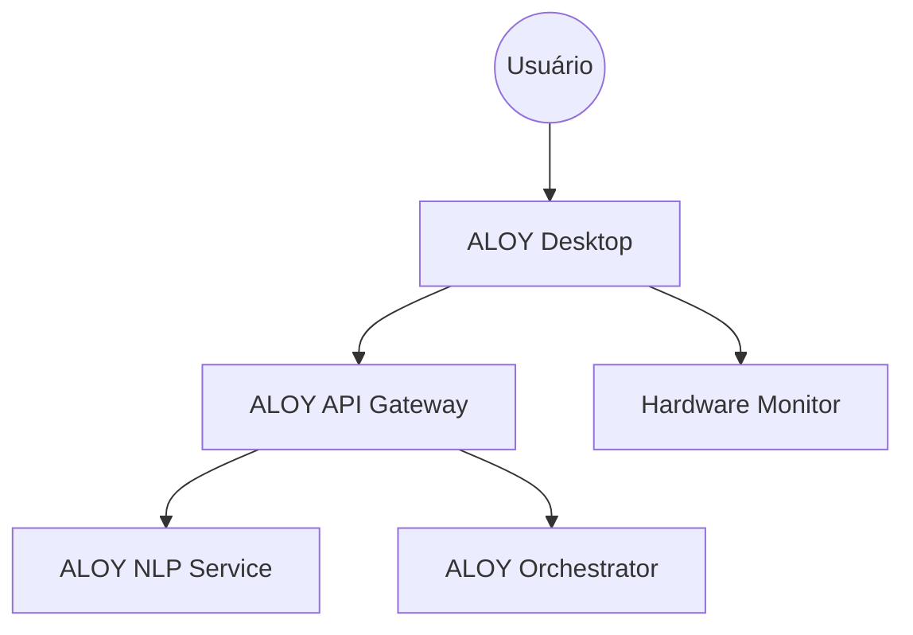

# 🖥️ ALOY Desktop Electron (v1)

<p align="center">
  
  
  
  
</p>

## 🌟 Visão Geral
O **ALOY Desktop** é a interface central de interação humana do ecossistema ALOY. Desenvolvido em **Electron**, ele serve como o \"Painel de Comando\" que unifica voz, monitoramento de hardware e automação inteligente diretamente no seu PC ou Notebook.

> \"A interface que não apenas executa, mas ajuda você a pensar.\"

## 🚀 Funcionalidades Premium
- 🎙️ **Voice First:** Integração com `aloy-stt` e `aloy-tts` para comandos naturais.
- 📊 **Real-time Monitoring:** Dashboard integrado com `aloy-hardware-monitor`.
- 🧠 **Socratic Interface:** Modo \"Mentor\" que desafia o usuário com perguntas profundas via NLP.
- ⚡ **N8N Automation:** Acionamento de rotinas complexas (Work/Game/Study) com um clique.
- 📱 **Multi-device Sync:** Estado sincronizado entre todos os seus dispositivos via `aloy-orchestrator`.

## 🛠️ Stack Tecnológica
- **Framework:** Electron + React (Next.js)
- **Linguagem:** TypeScript
- **Estilização:** Tailwind CSS
- **Comunicação:** WebSockets & HTTP (via API Gateway)

## 🏗️ Arquitetura de Conexão


## 📦 Instalação
1. Clone o repositório:
   ```bash
   git clone https://github.com/LuisMarchio03/aloy-desktop-electron-v1.git
   ```
2. Instale as dependências:
   ```bash
   npm install
   ```
3. Configure o `.env` apontando para o seu `ALOY_API_GATEWAY`.
4. Inicie em modo dev:
   ```bash
   npm run dev
   ```

## 🤝 Contribuição
Este é o front-end core do projeto. Pull Requests para melhorias na UX/UI são extremamente bem-vindos!

---
<p align="center">Desenvolvido com ❤️ para um futuro mais produtivo.</p>
